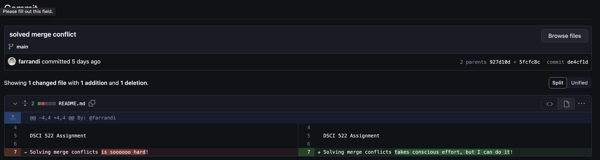

# Individual Assignment 1

Farrandi Hernando

Repository: [https://github.com/farrandi/learning-about-version-control](https://github.com/farrandi/learning-about-version-control)

Screenshot of merge conflict resolution:

## Why use branch-pull-request workflow?

- It allows for more organization and better communication for the team. Everyone knows what everyone else is working on and can see the progress of the project, this is especially important as projects grow larger, using branch-pull-request will help everyone just focus on doing their own work without worrying about conflicts or anything else. It also ensures that the main branch is always stable and working.
